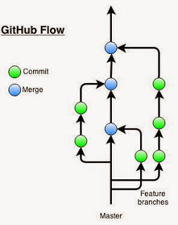

# Workflow
Definition of LamadalCore workflow.

* Anything in the master branch is deployable
* To work on something new, create a descriptively named branch off of master (ie: new-oauth2-scopes)
* Commit to that branch locally and regularly push your work to the same named branch on the server
* When you need feedback or help, or you think the branch is ready for merging, open a pull request
* After someone else has reviewed and signed off on the feature, you can merge it into master
* Once it is merged and pushed to ‘master’ on the origin, you can and should deploy immediately to nuget.
* If this is not a pre-release - then create 'release/x.x.x' branch. (Do not use tags)

# Test results & Code coverage: 

