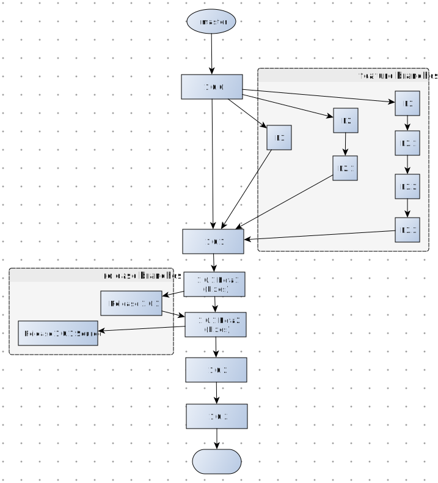
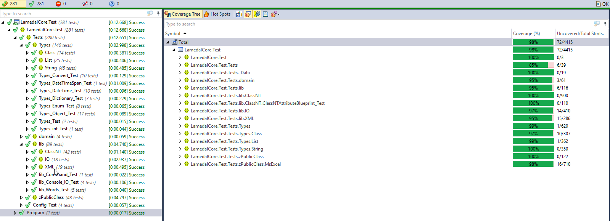

# Workflow
Definition of LamadalCore workflow.

# Development
* Main development will occur on master branch.
* All new features need to be on branches and merged to master 
* Before merge to master, new feature must have 100% test coverage. (Deviation of 95%-98% unit test coverage are allowed in cases where test cases are difficult).  

# Release
* Once master is release ready - new features added all test cases are working -> Create NuGet package x.x.x Beta1.
*  Create release branches from master -> 'Release x.x.x' and remove the src folder and use the Nuget package for the test cases. 
* Ensure test cases build with Appveyor on Release x.x.x. 
  + If not successful-> fix on master and redeploy NuGet x.x.x Beta2. (Repeat this process until success)
  + If all tests success -> deploy Nuget x.x.x; 
* Create branch 'Release x.x.x Source' from master

# Forking
* Fork master if you want to use the latest version of the library. This is useful to add new features.
* Fork latest release branches for stable releases.

# Motivation of Workflow
* The workflow is optimized to ensure fast development, delivery and enhancements on master.
* With releases branches are created to ensure stability of derived work.
* The master branch will be radically refactored from time to time (in order to ensure good quality of code). It may not be practical to merge back to master (because of the dynamic nature of master).

# Test results & Code coverage: 

